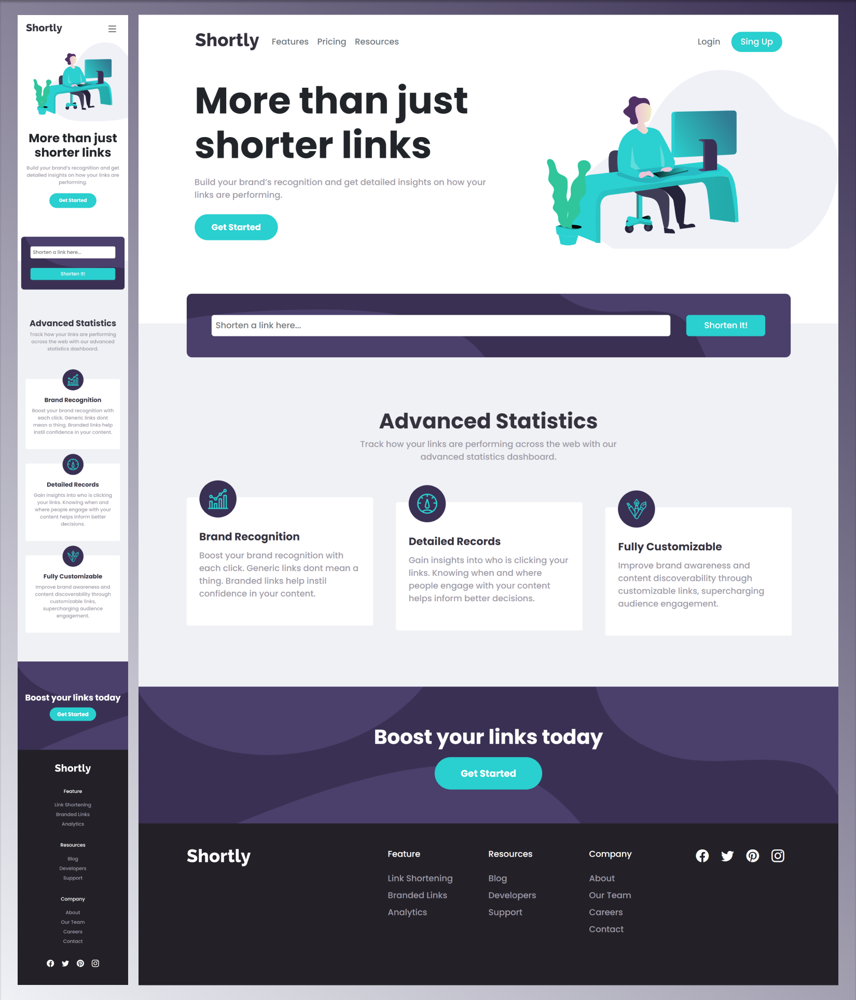

Bem-vindo ao QuickLink, uma página que permite aos usuários encurtar URLs usando a API shrtcode.

Projeto construído a partir do desafio disponível da [FrontendMentor](https://www.frontendmentor.io/challenges/url-shortening-api-landing-page-2ce3ob-G). Utilizei o design fornecido pela plataforma e elaborei a página da maneira mais fidedigna possível, desenvolvido com React.js e Bootstrap. E esse foi o meu resultado final 💻<https://quicklink-kk3g.vercel.app/>.



> Veja o comparativo da minha solução com o resultado esperado, [clicando aqui!](https://www.frontendmentor.io/solutions/quicklink-uma-pgina-para-encurtar-urls-0bxwE7NWJr)

</br>

## 🎯 Objetivos

Os usuários devem ser capazes de:

> - Visualizar o layout ideal para o site, dependendo do tamanho da tela do dispositivo
> - Encurtar qualquer URL válida

O objetivo é replicar o design fornecido o mais fielmente possível, garantindo que a página seja responsiva e se adapte ao tamanho da tela em que é exibida. Além disso, os usuários podem gerar links encurtados

</br>

## 🔧 Propriedades e Tecnologias

> - Vite
> - React
> - Bootstrap 4
> - SASS
> - Mobile-first
> - Semântica HTML
> - API (shrtcode)

</br>

## 🧠 Meu aprendizado

> - Bootstrap 4

O Bootstrap é um framework popular e poderoso que permite aos desenvolvedores criar interfaces responsivas com facilidade. Nesta semana dediquei a me aprofundar na ferramenta, para explorar todo seu potencial.

React.js

```js
...
<footer className='container-fluid bg-quaternary-color' id='footer'>
  <div className='container'>
      <div className="row justify-content-center justify-content-md-start pb-5 py-md-5">
          <div className="col-12 text-center py-5 col-md-4 text-md-left px-md-0 py-md-0">
              
          </div>...
```

O Bootstrap funciona aplicando classes diretamente nos componentes, no exemplo acima vemos que ele oferece um sistema de grid flexível, adaptando-se perfeitamente a diferentes tamanhos de tela e dispositivos, composto pelas classes "container", "row" e "col", todas podem ser usadas individualmente em qualquer breakpoint desejado, no exemplo temos as classes: col-12 e col-md-4. O "col-12" significa que a "div" receberá por padrão a largura de 12 frações (ou seja, no mobile receberá a largura máxima do contêiner), e o "col-md-4" representa que a mesma passará a ter 4 frações de largura, mas apenas quando atingir p breakpoint "md" (768px).

```js
...
<a
  className="btn font-primary-color bg-button-color rounded-pill btn-lg px-4 px-md-5 py-md-3 font-weight-bold"
  href="#"
  role="button"
>Get Started</a>
...
```

Com uma ampla gama de componentes prontos para uso, como botões, menus, formulários e carrosséis, mas ainda assim com muitos utilitários que permitem a criação de novos componentes e a personalização dos que já existem, como, por exemplo alterar a padding no eixo x com "px-4". O Bootstrap agiliza o processo de desenvolvimento, economizando tempo e esforço.

</br>

## 💻 Rodando o projeto

Para conferir a versão final é só acessar o link: 💻<https://quicklink-kk3g.vercel.app/>.

</br>

## Autor

- LinkedIn - [Pedro A. Lima](https://www.linkedin.com/in/pedroalima6/)
